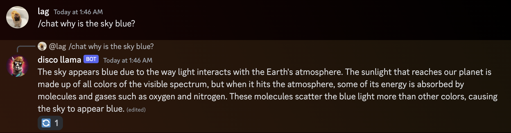

# disco-llama

A LLM-based Discord bot, written in Ruby.

You can run it locally in your own machine to connect to your discord server.
Your models on your hardware, no OpenAI required, no gimped AI forced down your
throat.

This is very work in progress at the moment and very much an experimental project.
Aside from the basic stuff, I'm currently adding what I think would be interesting
to this without much regard to applicability.

## Getting Started

### Installing

You'll need:

- Ruby `>= 3.2.2`
- [Ollama](https://ollama.ai) `>= 1.15`
- [A discord bot token.](https://discord.com/developers/docs/getting-started)
  - we ❤️ AI, so why not generate a nice bot profile pic with [midjourney](https://midjourney.com)?

Run `bin/setup` to install Ruby dependencies. Install this gem onto your local
machine with `bundle exec rake install`.

### Usage

Write a configuration file in Ruby like the following (check `example_config.rb`
for more examples):

```ruby
DiscoLlama.configure do |config|
  config.discord.token = "YOUR DISCORD TOKEN"
  # change your Ollama instance URI with the following
  # config.ollama.base_uri = "http://localhost:11434/api"

  config.on :bot_start do |bot|
    # register default commands on startup
    bot.register_commands!
  end
end
```

Then run the bot with `disco-llama start <path-to-your-config>`.
The discord bot invite URL will be printed out by the `start` command, you can
use it to add the bot to your server.

Then try `/chat`ting with your bot.



## Roadmap

- [ ] simple conversational bot
  - [ ] be able to re-generate replies
  - [ ] be able to reply to the bot
  - [ ] multiple users can reply to the bot
    - not sure how this would work, but would probably be cool
- [ ] memory -- make the bot be able to remember stuff across conversations

- [ ] improve docker support
  - currently you can build a docker image for this, but not do much more with it
  - it'd be nice to have the `docker-compose.yml` file actually work
  - not exactly a priority now because it's simpler to run the lib + ollama locally
    on a Mac

possibly very far future?

- [ ] moderation -- add moderation actions to the bot

## Development

`rake spec` runs the tests (not any rn, sorry).
`bin/console` runs an interactive prompt with the library loaded.

I usually run `./exe/disco-llama` directly to test stuff while changing it. It'd
be nice to add some hot-reloading in the future for dev environments.

You might also want to consider having your own `.env` files with configurations
instead of adding your discord token and other stuff to the config file. Check
`example.env` for what variables you might want to have there.

To release a new version:

1. Update the version number in `version.rb`
2. run `bundle exec rake release`

## Contributing

Bug reports and pull requests are welcome [on GitHub](https://github.com/leoagomes/disco_llama).

## License

The gem is available as open source under the terms of the [MIT License](https://opensource.org/licenses/MIT).
